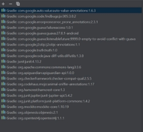
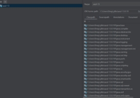
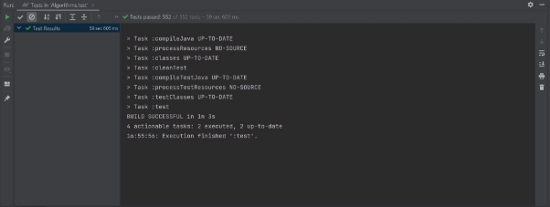
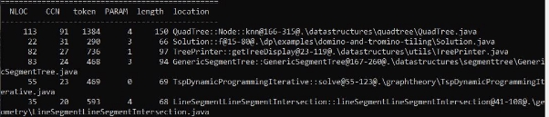

# Report for assignment 3

This is a template for your report. You are free to modify it as needed. It is not required to use markdown for your report either, but the report has to be delivered in a standard, cross-platform format.

## Project

**Name**: Algorithms & data structures project **URL**: <https://github.com/williamfiset/Algorithms>

**One or two sentences describing it:** It is a Java-based project with 99.3% written in Java. The project includes a lot of algorithms and functions to solve problems in different categories like Math, Geometry and various collections of searching and sorting algorithms.

## Onboarding experience

**Did it build and run as documented?**

Yes, the project was successfully built by using the command line or the IDE IntelliJ IDEA. Gradle was needed to build and run the tests, and it was installed automatically.

No other external tools were needed for this purpose. Also, all existing tests ran successfully using IDE IntelliJ IDEA.

**See the assignment for details; if everything works out of the box, there is no need to write much here. If the first project(s) you picked ended up being unsuitable, you can describe the "onboarding experience" for each project, along with the reason(s) why you changed to a different one.**

## Complexity

**1.What are your results for six complex functions?**

We followed the steps in the assignment, and for the complexity measurement tool, we used lizard on the codebase. The Cloc for the project was > 30K.

To count cyclomatic complexity, we used the lizard tool. With the following command: "lizard  -s cyclomatic\_complexity -l java", we got the results sorted regarding the cyclomatic complexity.

All of us got the same results using the tool.

**a.Did all methods (tools vs. manual count) get the same**

**result?**

The manual count depended on the definition of [cyclomatic complexity](https://en.wikipedia.org/wiki/Cyclomatic_complexity). Two of us counted the cyclomatic complexity for the most complicated functions that we received using the tool. The results were almost the same two of five were different a little. We got the same results for both of us.

**b.Are the results clear?**

Yes, Very clear.

**2.Are the functions just complex, or also long?**

No. The most complex functions are not always the longest ones, they have the most judgements.

**3.What is the purpose of the functions?**

QuadTree: A QuadTree implementation with integer coordinates.

Solution: This is the solution of the so-called Domino and Tromino tiling problem.

TreePrinter: This is used to print a binary tree.

Suffixarrayfast: This function is used to capture and analyze the behavior of a suffix array.

TreeIsomorphismWithBfs: This function is used to build a tree’s Isomorphism by using Breadth-first search.

AVLTreeRecursive: This function is used to realize an AVL tree, which means the tree can self balance itself to keep operations logarithmic. 

**4. Are exceptions taken into account in the given measurements?**

No, we do not think so. And this may explain why the manual count differs from the results given by Lizard.

**5.Is the documentation clear w.r.t. all the possible outcomes?**

The Solution, the TreePrinter the Suffixarrayfast the TreeIsomorphismWithBfs and the AVLTreeRecursive are clear, but the QuadTree is still under development.

Refactoring

Plan for refactoring complex code:

Estimated impact of refactoring (lower CC, but other drawbacks?). Carried out refactoring (optional, P+):

git diff ...

Coverage

Tools

Document your experience in using a "new"/different coverage tool.

How well was the tool documented? Was it possible/easy/difficult to

integrate it with your build environment?

Your own coverage tool

Show a patch (or link to a branch) that shows the instrumented code to

gather coverage measurements.

The patch is probably too long to be copied here, so please add the git command that is used to obtain the patch instead:

git diff ...

What kinds of constructs does your tool support, and how accurate is

its output?

Evaluation

1. How detailed is your coverage measurement?
1. What are the limitations of your own tool?
1. Are the results of your tool consistent with existing coverage tools?

Coverage improvement

Show the comments that describe the requirements for the coverage. Report of old coverage: [link]

Report of new coverage: [link]

Test cases added:

git diff ...

The number of test cases added: two per team member (P) or at least four (P+).

Self-assessment: Way of working

Current state according to the Essence standard: ...

Was the self-assessment unanimous? Any doubts about certain items? How have you improved so far?

Where is the potential for improvement?

Overall experience

What are your main take-always from this project? What did you learn?

Is there something special you want to mention here?
